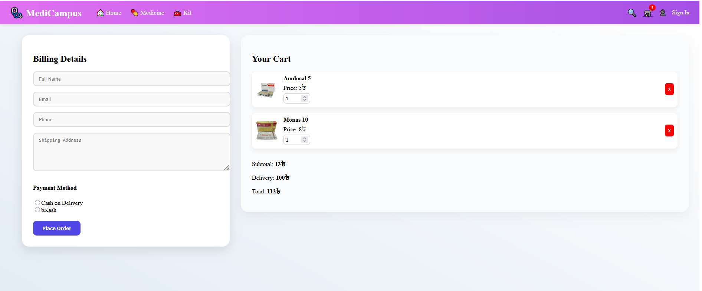
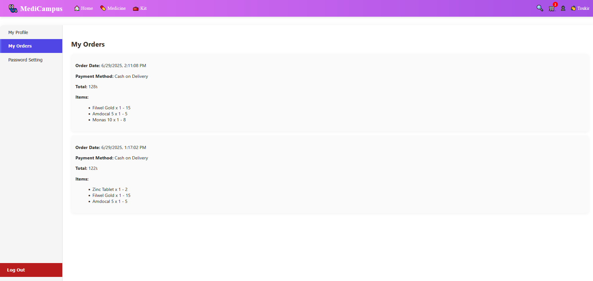
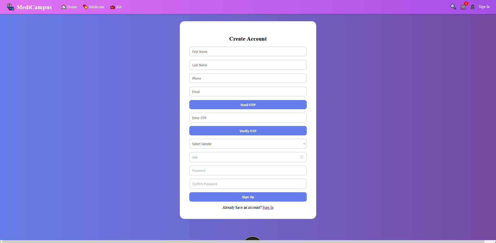
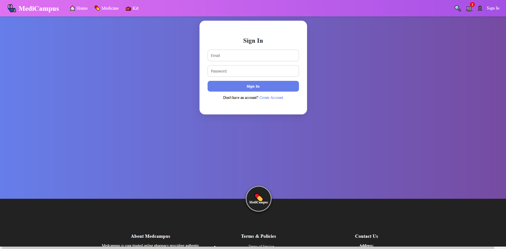
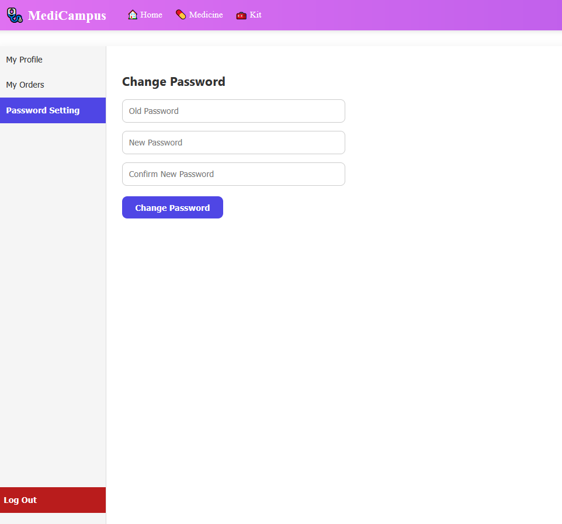

# 🚀 MediCampus - FullStack React Web Application

A **modern**, **responsive**, and **feature-rich** e-commerce React app backed by Firebase for authentication, database, and order management.  
Designed for smooth shopping experiences with clean UI and seamless backend integration.

---

## ✨ Features

- 🔐 **User Authentication** with Firebase (Email/Password)
- 🛒 Fully functional **Shopping Cart** with quantity controls
- 💳 Multiple payment options: **Cash on Delivery**, **bKash**
- 📦 Orders saved globally & under user profile in Firestore
- 👤 Profile page showing user info, order history & password change
- 📱 Responsive design with clean and minimal UI
- 🔔 Real-time notifications with React Toastify

---

## 🛠️ Technologies Used

- ⚛️ React.js (Functional Components & Hooks)
- 🔥 Firebase (Authentication & Firestore Database)
- 🔄 React Router (Client-side routing)
- 🎉 React Toastify (User notifications)
- 🎨 Inline CSS Styling for fast prototyping & customization

---

## 🖼️ Screenshots

| Home / Product Listing | Shopping Cart / Checkout | User Profile / Orders |
|:---------------------:|:-----------------------:|:--------------------:|
|  |  |  |

| SignUp Form | SignIn Form | Password Change Form |
|:-----------:|:-----------:|:--------------------:|
|  |  |  |

---

## 🚀 Getting Started

### Prerequisites

- Node.js & npm installed ([Download here](https://nodejs.org/))
- Firebase project with Authentication & Firestore configured

---

### 📞 Contact

If you have any questions, feedback, or want to collaborate, feel free to reach out!

- 📧 **Email:** toukir.jibon22@gmail.com
- 🐙 **GitHub:** [TOUKIR21AHMED](https://github.com/TOUKIR21AHMED)

---

### Installation

```bash
git clone https://github.com/TOUKIR21AHMED/MediCampus_Next.Js_FullStack.git
cd MediCampus_Next.Js_FullStack
npm install
npm start


