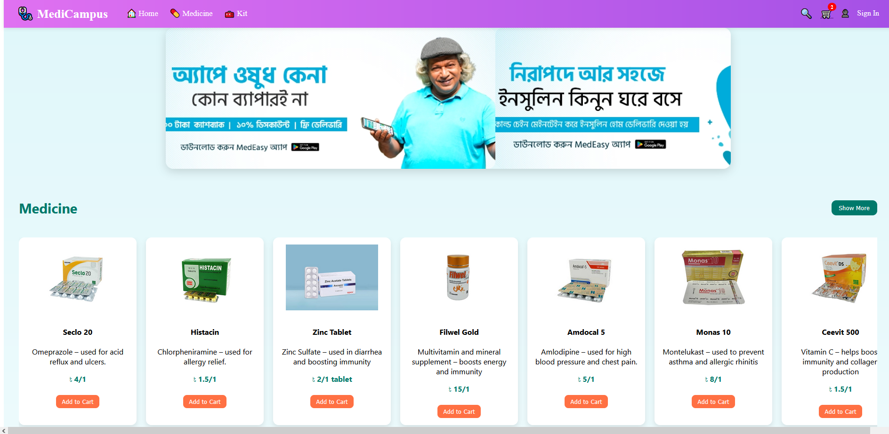

# MediCampus - FullStack React Web Application

A modern, responsive e-commerce React web application with Firebase backend for authentication, Firestore database, and order management.

---

## Features

- User Authentication with Firebase (Email/Password)
- Fully functional shopping cart with quantity management
- Place orders with multiple payment options (Cash on Delivery, bKash)
- Orders saved in Firestore under user profile and global orders collection
- Profile page with user info, order history, and password change functionality
- Responsive design with clean UI

---

## Technologies Used

- React.js (Functional Components, Hooks)
- Firebase (Authentication, Firestore)
- React Router for navigation
- React Toastify for notifications
- Inline CSS styling for fast prototyping

---

## Screenshots

### 1. Home / Product Listing  


### 2. Shopping Cart and Checkout  


### 3. User Profile with Orders  


### 4. SignUp Form 


### 5. SignIn Form  


### 4. Password Change Form  


---

## Getting Started

### Prerequisites

- Node.js & npm installed
- Firebase project setup (authentication & firestore)

### Installation

```bash
git clone [https://github.com/yourusername/your-repo.git](https://github.com/TOUKIR21AHMED/MediCampus_Next.Js_FullStack)
cd your-repo
npm install
npm start
